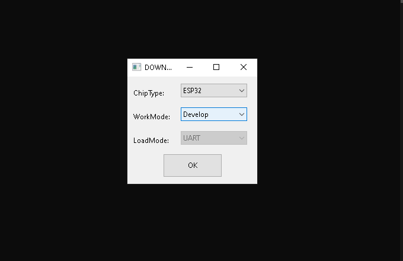
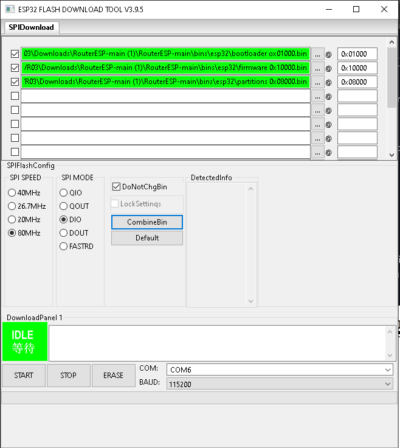
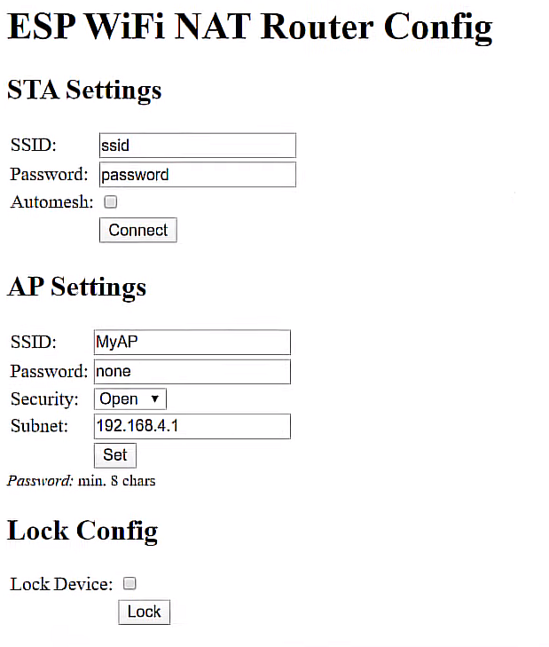

# RouterESP
El proyecto contiene la herramienta para flashear placas Esp32 y Esp8266 en windows y los binarios con su dirección de inicio (address offset)

Instrucciones
---------------
*Windows*
---------------

- El ejecutable de la herramienta de flasheo está incluido en el proyecto, solo hay que abrirlo ![flash_download_tool_3.9.5(flash_download_tool_3.9.5/)]
- Ya dentro vamos a seleccionar nuestra placa



- configuramos los parametros del flaseo (los default están bien), los binarios con su dirección de inicio correspondiente



-iniciamos el flaseo, presionamos el boot en nuestra placa y esperamos que termine

- Una vez terminado vamos a configurar el nodemcu, nos conectamos al wifi "MYAP" y entrando a cualquier navegador e ingresando la dirección 192.168.4.1 accederemos a la configuración del router, que es bastante intuitiva



- STA setting: la dirección y contraseña del router al que se va a conectar el nodemcu
- AP settings: la dirección y contraseña para conectarse al nodemcu


# Linux
---------------
- Utilizaremos la herramienta esptool (esptool.py) y lanzaremos el siguiente comando (luego de --chip va el modelo de tu esp)
```
esptool --chip esp32 \
--before default_reset --after hard_reset write_flash \
-z --flash_mode dio --flash_freq 40m --flash_size detect \
0x1000 build/esp32/bootloader.bin \
0x8000 build/esp32/partitions.bin \
0x10000 build/esp32/firmware.bin
```
